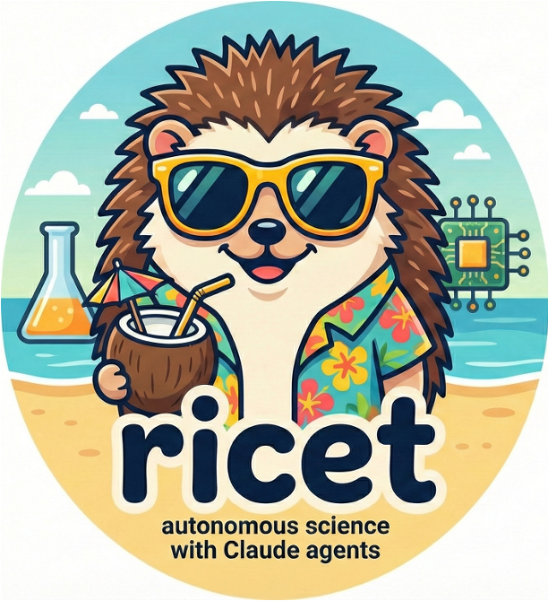

<p align="center">
  
</p>

# ricet

**Automate scientific research using Claude Code with structured skills, persistent knowledge, and overnight autonomous execution.**

Created by **Luca Fusar Bassini**.

---

ricet is a CLI tool and framework that manages the full lifecycle of scientific research projects. It pairs Claude Code with eight research skills (slash commands), a persistent knowledge system that compounds insights across sessions, reproducibility enforcement, and a complete paper pipeline -- so you can focus on the science while automation handles the scaffolding.

---

## Why ricet?

Running a research project involves dozens of repetitive tasks: environment setup, literature searches, experiment tracking, figure generation, paper writing, and more. ricet provides a single `ricet` command that orchestrates all of these through structured AI skills operating inside a safe, containerized environment.

| Problem | Solution |
|---------|----------|
| Ad-hoc experiment tracking | Lab/stable bipartition with promotion gates and provenance tracking |
| Scattered knowledge | Persistent encyclopedia, rules, and decision log that grow automatically |
| Tedious boilerplate | Project templates with skills, hooks, LaTeX, and CI/CD out of the box |
| Unsafe autonomous runs | Docker sandbox with permission model and auto-backup |
| Manual paper formatting | Integrated LaTeX pipeline with colorblind-safe figures and citation management |
| Presentation preparation | AI-generated slide decks with Nano Banana Pro schematics |
| Lost insights between sessions | Meta-learn hook auto-captures rules, insights, and decisions from every prompt |
| No remote monitoring | Mobile access via Tailscale or Cloudflare Tunnel |

---

## Quick Start

```bash
# Install Claude Code (requires Node.js 20+)
npm install -g @anthropic-ai/claude-code

# Authenticate with Claude subscription (Pro or Team required, no API key needed)
claude auth login

# Clone and install ricet
git clone https://github.com/lucafusarbassini/research-automation
cd research-automation
pipx install ".[mobile]"

# Create your first project (interactive wizard)
ricet init my-project

# Edit your research goal
cd my-project
$EDITOR knowledge/GOAL.md

# Launch a persistent Claude session
ricet up
```

**That's the core workflow: `ricet init` then `ricet up`.**

`ricet init` auto-detects your system (GPU, conda, Docker), installs the full toolchain (Docker Compose v2, screen, Tailscale, uv, tectonic), walks you through credential setup, deploys research skills, and optionally creates a GitHub repository.

`ricet up` launches a Docker-sandboxed Claude session inside a GNU Screen, with three input channels: CLI (`screen -r`), Claude Remote Control (QR code), and a mobile dashboard via Tailscale (voice + text). Sessions auto-resume on disconnect via `--continue`.

See the full [Quickstart Tutorial](quickstart.md) for a step-by-step walkthrough.

---

## Feature Highlights

- **8 Research Skills** -- Slash commands (`/lit-review`, `/experiment-review`, `/paper-draft`, `/falsify`, `/reproduce`, `/research-retro`, `/overnight`, `/slides`) give Claude structured workflows for every research task.
- **Persistent Knowledge System** -- RULES.md (behavioral), ENCYCLOPEDIA.md (domain), DECISION_LOG.md (architectural) -- all auto-populated by the meta-learn hook from your interactions.
- **Lab/Stable Bipartition** -- Experimental code in `lab/`, promoted to `stable/` via `ricet promote` with provenance tracking (git hash, timestamp, metrics).
- **Code Indexing & Search** -- `ricet index-code` extracts function/class signatures; `ricet search-code` does semantic search over the index.
- **Feature Request Pipeline** -- `ricet feature-request` logs ideas; `ricet implement-features` builds selected ones in parallel worktrees.
- **Collaborative Research** -- Multiple researchers on the same repo with personal branches, `ricet morning-sync` merges, and user attribution.
- **Adopt Existing Repos** -- `ricet adopt` transforms any GitHub repo into a ricet project with fork, scaffold, and personal branch.
- **Sandbox Infrastructure** -- `ricet sandbox` manages a fully isolated Docker sandbox with auto-backup and work extraction.
- **Slide Deck Generation** -- `ricet slides` creates .pptx decks with AI-generated schematics via Nano Banana Pro (Gemini 3 Pro).
- **Mobile Access** -- Tailscale (default) or Cloudflare Tunnel for secure access from any device. Screen sessions for persistence.
- **Overnight Mode** -- Autonomous execution loop with auto-debug, resource monitoring, and recovery.
- **Paper Pipeline** -- LaTeX template, BibTeX management, tectonic compilation, style transfer.
- **gstack Integration** -- `ricet gstack install` adds Garry Tan's startup workflow skills alongside ricet's research skills.
- **Voice Prompting** -- `ricet voice` transcribes audio in 30+ languages and executes the prompt.
- **Cascading Self-Update** -- When ricet is updated, existing projects get refreshed skills and defaults automatically.
- **Cross-Repository Code Search** -- Link external repos with `ricet link` so Claude can search across all your code.
- **context-hub** -- Versioned API documentation via `ricet chub`.
- **MCP Discovery** -- `ricet mcp-search` searches 1300+ MCP servers and installs on demand.
- **Auto-Commit & Push** -- Every state-modifying command automatically commits and pushes.
- **Global Credential Store** -- `~/.ricet/credentials.env` stores API keys once across all projects.
- **Interactive Dashboard** -- `ricet dashboard` Rich TUI with live progress and resource monitoring.
- **Zenodo Publishing** -- `ricet zenodo` publishes software, datasets, and papers with permanent DOIs.

Explore all features in the [Features](features.md) page.

---

## Project Philosophy

ricet is built on six core principles:

1. **Never please the user** -- Be objective, challenge assumptions, report flaws.
2. **Popperian falsification** -- Try to break results, not validate them.
3. **Never guess** -- Search or ask when uncertain.
4. **Test small, then scale** -- Downsample first, run one epoch, then scale up.
5. **Commit aggressively** -- Meaningful commits after every subtask.
6. **Accumulate knowledge** -- The encyclopedia grows with every task.

---

## Project Status

ricet is under active development. The core modules, CLI, templates, and skill system are implemented. Contributions and feedback are welcome.

| Component | Status |
|-----------|--------|
| CLI (`ricet` command, 55+ commands) | Implemented |
| Core modules (50+ modules) | Implemented |
| Research skills (8 slash commands) | Implemented |
| Persistent knowledge system | Implemented |
| Meta-learn hook (auto-capture) | Implemented |
| Lab/stable bipartition | Implemented |
| Paper pipeline | Implemented |
| Slide deck generation | Implemented |
| Docker sandbox infrastructure | Implemented |
| claude-flow integration | Implemented (optional) |
| gstack integration | Implemented |
| Mobile access (Tailscale/Cloudflare) | Implemented |
| Collaborative research workflow | Implemented |
| Cascading self-update | Implemented |
| Code indexing & search | Implemented |
| Feature request pipeline | Implemented |
| Reproducibility pipeline (`/reproduce`) | Under development |
| Manual curation of MD skills | Under development |
| Documentation site | You are here |

---

## About

ricet is designed and maintained by **Luca Fusar Bassini**.

---

## License

MIT
